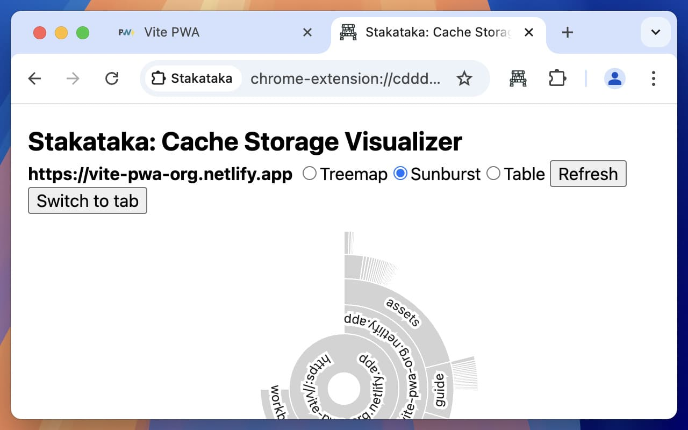

# Stakataka

A browser extension that visualizes (Service Worker) Cache Storage for web sites. Stakataka helps developers understand what's stored in the browser's cache storage ([`window.caches`](https://developer.mozilla.org/en-US/docs/Web/API/Window/caches), [`CacheStorage`](https://developer.mozilla.org/en-US/docs/Web/API/CacheStorage)) and how much space it occupies through multiple visualization options.

Available for Chrome, for now.

> [!NOTE]
> Cache storage is different than the browser's own cache, localStorage, sessionStorage, IndexedDB, and other storage APIs. It is used by Service Workers to cache network requests and responses for offline access and faster loading times.

## Features

- Scan Cache Storage for the active tab
- Multiple visualization options:
  - Treemap view
  - Sunburst chart view
  - Tabular view with sorting and pagination

## Screenshots





## Usage

1. Navigate to a web page
2. Click the Stakataka extension icon
3. Click "Visualize Cache Storage"
4. View the cache data in your preferred visualization format

## Development

```
npm install
npm run dev
```

## Technologies

- [WXT](https://wxt.dev/) - Web Extension development framework
- [React](https://react.dev/) - UI framework
- [webtreemap](https://github.com/evmar/webtreemap) ([fork](https://github.com/paulirish/webtreemap-cdt)) - Treemap visualization
- [react-sunburst-chart](https://github.com/vasturiano/react-sunburst-chart) - Sunburst chart visualization
- [react-data-table-component](https://github.com/jbetancur/react-data-table-component) - Data table component
- [pretty-bytes](https://github.com/sindresorhus/pretty-bytes) - Byte formatting utility

## Mascot

[Stakataka](https://bulbapedia.bulbagarden.net/wiki/Stakataka_(Pok%C3%A9mon)) is a dual-type Rock/Steel Ultra Beast Pokémon.

## Contributing

Contributions are welcome! If you'd like to contribute, please open an issue or submit a pull request.

## License

[MIT License](https://cheeaun.mit-license.org/)
